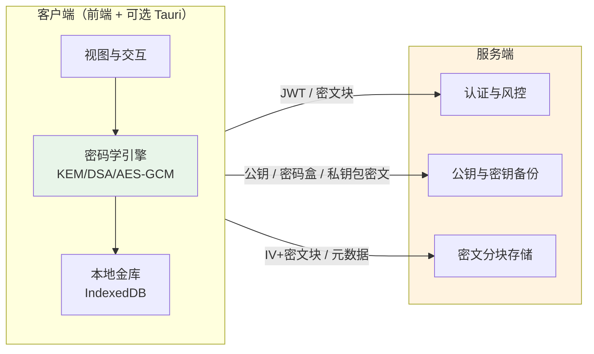

# QuantumGuard 项目总览

**QuantumGuard** 是一款基于零信任架构与后量子密码学的端到端加密（E2EE）文件传输系统。本文档从整体视角描述系统架构、安全模型与前后端分工。

---

## 1. 项目简介

| 项目 | 说明 |
|------|------|
| **目标** | 在服务器不接触明文密钥与文件内容的前提下，实现用户认证、密钥备份与加密文件的上传、存储与下载 |
| **安全原则** | 零信任存储（Server Blindness）、后量子算法（ML-KEM-768 / ML-DSA-65）、端到端 AES-256-GCM |
| **形态** | Web 前端（Vue 3 + TypeScript）+ 可选 Tauri 2 桌面端（Rust）；后端（FastAPI + SQLite）仅负责认证、元数据与密文块存储 |

---

## 2. 快速体验 (Releases)

为了方便评审与测试，我们在项目根目录的 `release` 文件夹中提供了预编译的客户端程序，开箱即用，无需配置前端开发环境：

| 平台 | 文件路径 | 说明 |
|------|----------|------|
| **Android** | `release/QuantumGuard.apk` | 适配安卓设备的安装包，支持大文件并发加解密。 |
| **Windows** | `release/QuantumGuard_Setup.exe` | 基于 Tauri 2 构建的 Windows 桌面端独立安装包。 |

> **💡 提示**：直接运行上述客户端即可体验端到端加密流程。若需自行部署完整环境（含服务端），请参阅后文的文档索引及后端部署指南。

---

## 3. 系统架构

- **客户端**：生成并持有主密钥（MK）、ML-KEM/ML-DSA 密钥对；执行 KEM 封装/解封、HKDF 派生、AES-GCM 加解密、签名与验签；密码盒与私钥包密文仅存于服务端，客户端用密码在本地解密。
- **服务端**：不生成、不持有任何明文密钥；不参与对称密钥派生与文件加解密；不参与 KEM 解封或 DSA 验签。仅存储公钥、密码哈希、密码盒与私钥包密文、文件元数据及密文分块。

**设计理由**：密钥与明文仅存于客户端，可抵御服务器被入侵或数据泄露场景；即使数据库被完整导出，攻击者仍无法在未获得用户密码或私钥的前提下解密任何文件或密钥备份。

---

## 3. 安全模型

### 3.1 零信任存储（Server Blindness）

| 服务端可知 | 服务端不可知 |
|------------|--------------|
| 用户 ID、公钥、密码 bcrypt 哈希、可选邮箱 | 明文密码、主密钥 MK、任何私钥 |
| 密码盒与私钥包密文（不透明字节串） | 密码盒与私钥包明文内容 |
| 文件 ID、发送方/接收方、分块数、密文块 | 文件明文、对称密钥、KEM 共享秘密 |

即使数据库与磁盘被完整导出，攻击者仍无法在未获得用户密码的前提下恢复任何密钥或文件内容。

### 3.2 密码与密钥一致性

- **密码规范化**：前后端约定：UTF-8 编码超过 64 字节时，先取 SHA-256 再参与 bcrypt（后端）与 PBKDF2（前端）。避免超长密码被静默截断导致“登录成功但解不开密码盒”。
- **密码盒与破产重组**：忘记密码时，客户端生成新 MK、新密钥对与新密码盒；服务端用新值**覆盖**而非清空旧字段，避免账号在新设备上永久不可恢复（“绝户”问题）。

### 3.3 新设备与风控

- **已绑定邮箱**：新设备登录（无本地金库）时，服务端仅下发短期 `login_challenge_token`；客户端凭该 token 完成邮箱验证码流程后再换取 JWT，并拉取密钥备份。实现“密码 + 邮箱”双因子。
- **未绑定邮箱**：新设备登录时直接下发 JWT，允许仅凭密码恢复。

---

## 4. 技术栈与仓库结构

| 层级 | 技术 | 职责 |
|------|------|------|
| **前端** | Vue 3、TypeScript、Vite、Pinia |  UI、路由、会话；与密码学核心及服务层对接 |
| **桌面** | Tauri 2、Rust | PBKDF2 算力下沉、大文件解密流水线（并发拉取+解密+顺序写盘） |
| **后端** | FastAPI、SQLAlchemy、SQLite | 认证、公钥/密钥备份 CRUD、文件元数据与密文分块存储 |
| **密码学** | ML-KEM-768、ML-DSA-65、AES-256-GCM、HKDF、PBKDF2 | 密钥封装、签名验签、对称加密与密钥派生 |

文档与代码分布：

- **本仓库（前端）**：Web + Tauri 客户端；`README.md` 为前端与 Tauri 技术说明；`docs/LARGE_FILE_CRYPTO_FLOW.md` 为大文件加解密流程。
- **后端仓库**：FastAPI 服务；`README.md` 为后端接口、数据模型与环境配置。

---

## 5. 核心流程概览

### 5.1 注册与登录

1. **注册**：客户端生成 MK 与 KEM/DSA 密钥对 → 构建密码盒与本地金库 → 提交 user_id、密码哈希、公钥、密码盒与私钥包密文；邮箱与验证码可选。
2. **登录（本机有金库）**：密码校验通过后下发 JWT；客户端用密码解密本地金库并加载私钥。
3. **登录（新设备，已绑定邮箱）**：密码通过后下发 `login_challenge_token` → 发送邮箱验证码 → 验证码通过后下发 JWT → 客户端拉取密钥备份并恢复金库。

**设计理由**：新设备接口需在“无 JWT”状态下发验证码与校验验证码，故采用临时 `login_challenge_token` 鉴权，避免“必须先有 JWT 才能拿 JWT”的死锁；忘记密码时服务端以新密码盒与密钥**覆盖**而非清空，避免账号在新设备上永久不可恢复。

### 5.2 发送加密文件

1. 拉取接收方 ML-KEM 公钥。
2. KEM 封装得到共享秘密 → 生成 fileId → HKDF 派生 AES 密钥。
3. 文件按 5MB 分块，每块 AES-GCM 加密（AAD 绑定 fileId 与块序号），上传 IV+密文块。
4. 整文件 SHA-256，ML-DSA 签名 fileId∥kemCiphertext∥fileHash，提交 finalize 元数据。

### 5.3 接收与解密文件

1. 拉取元数据（kem_ciphertext、total_chunks 等）。
2. 本地 ML-KEM 私钥解封 → 同一 HKDF 派生 AES 密钥。
3. **Tauri**：单次调用 Rust `stream_decrypt_batch`，Rust 内 3 路并发拉取、解密并顺序写盘，可选文件预分配。
4. **浏览器**：`showSaveFilePicker` 或 StreamSaver 取得写入流，3 路并发拉取+解密，单写循环按块号顺序写盘，避免全量进内存。

5. **Android（Content URI）**：当保存路径为 `content://` 时，不调用 Rust 写盘（原生无法直接写 DocumentProvider）；由前端使用 `@tauri-apps/plugin-fs` 的 `writeFile(path, ReadableStream)`，在 JS 侧按块拉取、解密并推入 `ReadableStream`，由插件写入用户所选位置。

---

## 6. 文档索引

| 文档 | 位置 | 内容 |
|------|------|------|
| **项目总览** | 本文件 `PROJECT_OVERVIEW.md` | 架构、安全模型、流程概览 |
| **前端与 Tauri** | 本仓库 `README.md` | 运行与构建、模块划分、密码学调用链、大文件策略 |
| **大文件加解密** | 本仓库 `docs/LARGE_FILE_CRYPTO_FLOW.md` | 分块约定、上传/下载步骤、Tauri 与浏览器双路径 |
| **后端** | 后端仓库 `README.md` | 接口、数据模型、环境变量、部署说明 |

---

## 7. 许可与用途

本项目用于安全设计，可验证零信任、后量子E2EE相关技术。生产环境使用前需完成针对性的安全审计和加固。
